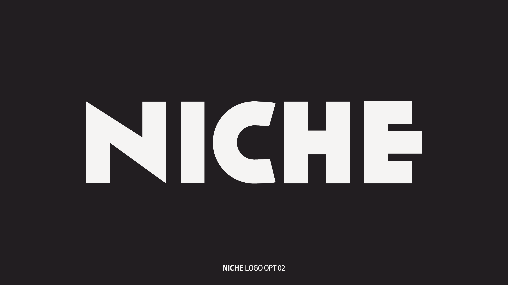
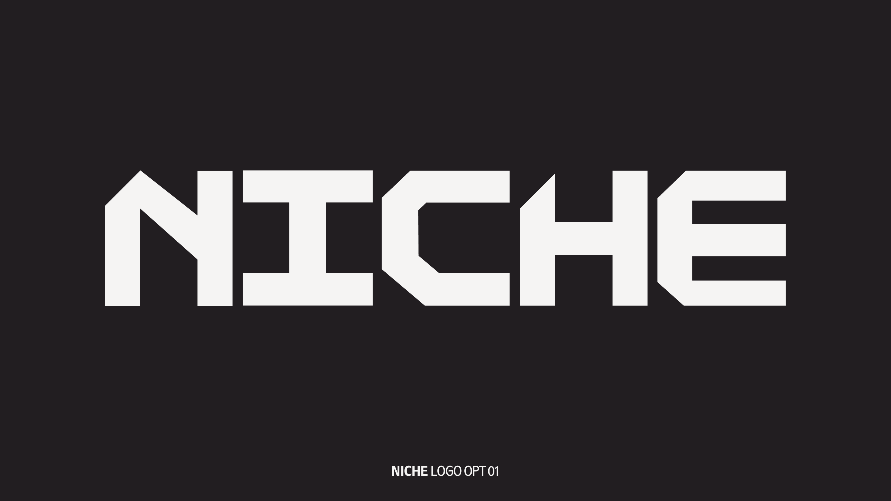
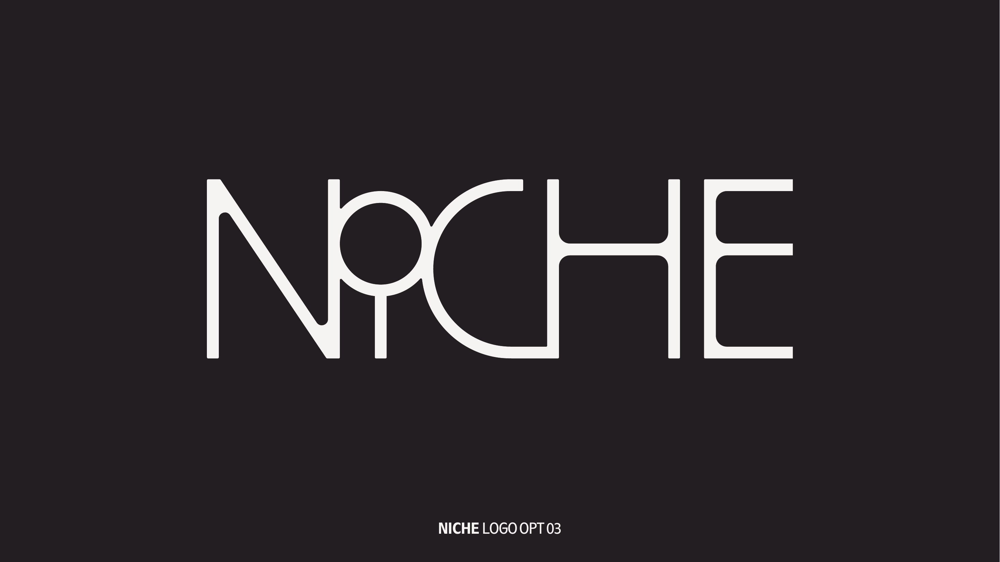

# NICHE — Brand Book

> **NICHE — New Institute of Creativity, Humanity & Entrepreneurship**
> *Find your niche*

**Version:** 1.0 — Working Draft
**Date:** 2026-05-06
**Status:** Documents existing brand assets from designer's PDF + research-backed system extensions
**Audience:** Designers, brand stewards, partners, vendors

---

## Table of Contents

| § | Section | Status |
|---|---|---|
| 1 | Brand Foundation | Scaffold |
| 2 | Brand Story | Scaffold |
| 3 | Logo System | **Fully Realized** |
| 4 | Pillar & Program Lock-Ups | Scaffold |
| 5 | Color | **Fully Realized** |
| 6 | Typography | **Fully Realized** |
| 7 | Photography & Art Direction | **Fully Realized** |
| 8 | Voice & Tone | **Fully Realized** |
| 9 | Iconography & Graphic Language | Scaffold |
| 10 | Motion System | **Fully Realized** |
| 11 | Digital & Social Templates | **Fully Realized** |
| 12 | Print & Physical Touchpoints | **Fully Realized** |
| 13 | Course Card & Certificate System | Scaffold |
| 14 | Faculty, Staff & Alumni Templates | Scaffold |
| 15 | Event & Wayfinding | Scaffold |
| 16 | Accessibility | **Fully Realized** |
| 17 | AI Content Policy | Scaffold |
| 18 | Partnership & Co-Branding | Scaffold |
| 19 | Asset Library & File Naming | Scaffold |
| 20 | Governance & Version Log | Scaffold |

---

## Executive Summary

| Decision | Recommendation |
|---|---|
| **Primary logo** | **OPT 02** (rounded humanist, tilted N) |
| **Submark** | **"N." house-mark** — system-canonical |
| **OPT 01** (chamfered geometric) | Sub-brand: **NICHE Labs / Tech / AI** |
| **OPT 03** (thin art-deco) | Editorial masthead: **NICHE Journal / Annual** |
| **Display type** | GT Sectra Display (target) — Fraunces (free interim) |
| **Body / Thai type** | Bai Jamjuree (Cadson Demak, SIL OFL) |
| **Palette** | 5 colors — held; green expanded with 2 tints/shades |
| **Restrictions** | `#fe1d25` and `#cccecd` may not be body text |
| **Format** | Web portal + Figma source + on-demand PDF |

---

# §1 — Brand Foundation

## Mission

> *Find your niche.*

NICHE is the New Institute of Creativity, Humanity & Entrepreneurship — built for the independent learner who refuses the standard track.

> **TODO** — final mission paragraph (brand owner draft pending)

## Three Pillars

### Creativity
The making, designing, storytelling, and crafting work that defines a creative practice in 2026.

### Humanity
The human experiences — hospitality, food, events, community — where craft meets people.

### Entrepreneurship
The business of independent practice — sales, automation, AI-native operations, first ventures.

## Twelve Programs (2026)

| Pillar | Program |
|---|---|
| Creativity | AI x Content Engine Studio |
| Creativity | Product & Experience Design Studio |
| Creativity | Creative Identity & Storytelling |
| Creativity | The Business of Craft |
| Humanity | New Hospitality |
| Humanity | Event & Experience Design |
| Humanity | Food Business 3.0 |
| Humanity | Community & Localization |
| Entrepreneurship | AI-native Business Builder |
| Entrepreneurship | SME Automation Lab |
| Entrepreneurship | Sales & Dealmaking |
| Entrepreneurship | First Venture Bootcamp |

## Cohort

**11–30 November 2026** — first flagship cohort. Intake is festival-style (cohorted, not rolling).

## Audience

Independent creators, makers, and entrepreneurs who want sharp practical skills over generic credentials. Bangkok-based with international reach.

> **TODO** — audience persona detail (3–5 archetypes, brand owner input required)

---

# §2 — Brand Story

> **TODO** — origin narrative (why was NICHE founded, what it replaces, what it refuses)

## What NICHE Is Not

- Not a degree-granting university
- Not a generic bootcamp pipeline
- Not a corporate-track upskilling product
- Not a mentor-of-the-month subscription

## Positioning Statement (working draft)

> For the independent maker who wants to do the work *seriously*, NICHE is the institute that teaches judgment over trends, craft over credentials, and the business of being your own thing.

> **TODO** — finalize positioning with brand owner

---

# §3 — Logo System

## The Three Marks

NICHE ships three logo treatments. They are not three options for one job — they are three voices in one system, each with a defined scope.

### OPT 02 — Primary Institutional Mark



Bold rounded humanist sans with a tilted "N" and an asymmetric "C". This is the institutional backbone — the mark that appears on every official touchpoint.

**Use for:** signage, billboards, brochures, certificates, digital headers, social profile, primary lockup.

**Why this one:** Editorial confidence without academic stiffness. The tilted N is the mnemonic. Humanist forms map to the *Humanity* pillar without illustrating it. Approachable to students, parents, and accreditors simultaneously.

### OPT 01 — NICHE Labs / Tech Sub-Brand



Bold geometric chamfered wordmark, Eurostile-adjacent. Industrial authority.

**Use for:** AI x Content Engine Studio · SME Automation Lab · AI-native Business Builder · hackathons · technical merchandise · partnership materials with engineering/AI partners.

**Why this scope:** The chamfered geometric register reads as "tech-sector / industrial" — exactly the right energy where OPT 02's warmth would feel mismatched.

### OPT 03 — NICHE Journal / Annual Masthead



Thin art-deco display with a circle replacing the dot of "i". Boutique, fashion-editorial register.

**Use for:** annual report cover · journal masthead · curated event series · special editorial publications.

**Why scoped to publications:** Fails embroidery (1mm minimum stroke), 16px favicon, and 2cm diploma reproduction tests. Beautiful at hero scale; unusable as an institutional mark. Frame it as a publication mark, not an institution mark.

### Submark — "N."

The "N." house-mark is the canonical submark. The period does genuine concept work: a *niche* is a carved recess; the period punctuates that claim. Read alone as *"NICHE."* — a confident declarative sentence-ender.

**Use for:** favicon · app icon · Instagram avatar · embossing · embroidery · contexts below 80px width.

## Clear Space

Minimum clear space on all four sides equals **0.5× the cap height** of the wordmark.

```
┌──────────────────────────┐
│   ▓                  ▓   │  ← 0.5x clear space
│   ▓                  ▓   │
│   ▓     N I C H E    ▓   │  ← wordmark
│   ▓                  ▓   │
│   ▓                  ▓   │  ← 0.5x clear space
└──────────────────────────┘
```

## Minimum Sizes

| Context | Minimum |
|---|---|
| Digital — primary lockup | 80px width |
| Digital — submark "N." | 16px square |
| Print — primary lockup | 20mm width |
| Print — submark "N." | 8mm square |
| Embroidery | submark only, ≥25mm height |
| Embossing / foil | submark only, ≥15mm height |

Below 80px digital / 20mm print, **the submark replaces the primary lockup.**

## Approved Color Variants

For each lockup, six approved variants must be available:

1. Full color on `#f2f1f0` (off-white)
2. Full color on `#252026` (near-black)
3. Single color black
4. Single color white (reversed)
5. Single color brand red `#fe1d25`
6. Greyscale

## Do / Don't

| Do | Don't |
|---|---|
| Use approved color variants only | Recolor outside the system |
| Maintain 0.5× cap-height clear space | Crowd with other elements |
| Use submark below minimum sizes | Stretch the primary lockup at small sizes |
| Place on solid backgrounds with ≥4.5:1 contrast | Place on busy mid-tone photo areas |
| Keep aspect ratio locked | Stretch, skew, or rotate (unless rotation is part of an approved animation) |
| Use the `.eps` or `.svg` source | Re-trace from a screenshot |

## File Format Guide

| Format | Use |
|---|---|
| `.svg` | Web, app, infinitely scalable |
| `.eps` | Print production, foil/embossing dies |
| `.pdf` | Vendor distribution, signage fabricators |
| `.png` (transparent, @1x/@2x/@3x) | Social media, presentations |
| `.rive` / `.lottie` | Motion contexts |

---

# §4 — Pillar & Program Lock-Ups

> **TODO** — design the lock-up grid for each of 12 programs.

## Hierarchy

```
NICHE                    ← parent institutional mark
   ↓
Pillar Badge             ← Creativity / Humanity / Entrepreneurship
   ↓
Program Name             ← e.g. "AI x Content Engine Studio"
```

## Rules

- Programs **never** appear without the parent NICHE mark on official communications.
- Pillar badges are optional in lockups but mandatory on cohort certificates.
- Program names use `type/h3` (Bai Jamjuree SemiBold 24px).
- Internal program documentation may use program name standalone, but external must show parent.

> **TODO** — finalize pillar badge designs (icon vs. wordmark vs. color-only system)

---

# §5 — Color

## Palette

| Hex | Token | Role |
|---|---|---|
| `#252026` | `color/surface/ink` | Primary text, dark fills |
| `#f2f1f0` | `color/surface/base` | Page background, reverse text |
| `#cccecd` | `color/surface/muted` | Dividers, disabled states **(no text)** |
| `#fe1d25` | `color/accent/brand` | Display, CTAs, icons **(large text only)** |
| `#779152` | `color/accent/secondary` | Program signage, category tags |
| `#4a5c33` | `color/accent/secondary-shade` | Accessible green for body text on light |
| `#b4c49a` | `color/accent/secondary-tint` | Decorative only |

## WCAG 2.2 AA Audit

| Pair | Ratio | Normal Text | Large Text |
|---|---|---|---|
| `#f2f1f0` ↔ `#252026` | 14.18:1 | ✅ Pass | ✅ Pass |
| `#cccecd` on `#252026` | 10.11:1 | ✅ Pass | ✅ Pass |
| `#fe1d25` on `#252026` | 4.12:1 | ❌ Fail | ✅ Pass |
| `#fe1d25` on `#f2f1f0` | 3.44:1 | ❌ Fail | ✅ Pass |
| `#779152` on `#252026` | 4.54:1 | ✅ Pass (barely) | ✅ Pass |
| `#779152` on `#f2f1f0` | 3.13:1 | ❌ Fail | ✅ Pass |
| `#cccecd` on `#f2f1f0` | 1.40:1 | ❌ Fail | ❌ Fail |
| `#4a5c33` on `#f2f1f0` | 7.21:1 | ✅ Pass | ✅ Pass (AAA) |

## Hard Rules

### 🛑 `#fe1d25` red — display only
- Allowed: ≥18pt regular, ≥14pt bold
- Prohibited: body text, hyperlinks, fine UI labels

### 🛑 `#cccecd` warm gray — never text
- Allowed: dividers, disabled states, decorative fills
- Prohibited: any text at any size on any background

### 🛑 `#779152` moss green — body text on `#252026` only
- Allowed: body on dark background, large display anywhere
- Prohibited: body text on `#f2f1f0` — use `#4a5c33` instead

## Semantic Tokens

```css
:root {
  --color-surface-base:            #f2f1f0;
  --color-surface-ink:             #252026;
  --color-surface-muted:           #cccecd;
  --color-accent-brand:            #fe1d25;
  --color-accent-secondary:        #779152;
  --color-accent-secondary-shade:  #4a5c33;
  --color-accent-secondary-tint:   #b4c49a;
}
```

## Print Reference

| Token | RGB | CMYK | Pantone (closest) |
|---|---|---|---|
| ink | 37 / 32 / 38 | 70 / 70 / 60 / 80 | Pantone Black 6 C |
| base | 242 / 241 / 240 | 4 / 3 / 4 / 0 | Pantone 11-0601 TCX |
| muted | 204 / 206 / 205 | 22 / 17 / 19 / 0 | Pantone Cool Gray 2 C |
| brand | 254 / 29 / 37 | 0 / 95 / 90 / 0 | Pantone 185 C |
| secondary | 119 / 145 / 82 | 50 / 23 / 80 / 5 | Pantone 7491 C |

## Dark Mode

> **TODO** — confirm `#252026` is the canonical dark surface, then derive on-surface tokens. Default proposal:

```css
@media (prefers-color-scheme: dark) {
  --color-surface-base:  #252026;
  --color-surface-ink:   #f2f1f0;
  /* accents unchanged but contrast re-verified */
}
```

---

# §6 — Typography

## Pairing

| Role | Family | License | Why |
|---|---|---|---|
| Display / Editorial | **GT Sectra Display** | Grilli Type (commercial) | Designed for *Reportagen* magazine. Calligraphic warmth × scalpel angularity. |
| Body / UI / Thai | **Bai Jamjuree** | SIL OFL via Google Fonts | Dual-script Thai + Latin in one file. Eurostyle-superellipse. By Cadson Demak. |

> **Interim:** Until GT Sectra is licensed, use **Fraunces** (Google Fonts, free SIL OFL) — variable axes (optical size + WONK) make it the closest free substitute.

## Type Scale

| Token | Family | Size (px / rem) | Weight | Line-height | Tracking |
|---|---|---|---|---|---|
| `type/display-xl` | Sectra Display | 144 / 9.0 | Black | 0.95 | −0.02em |
| `type/display` | Sectra Display | 88 / 5.5 | Bold | 1.0 | −0.02em |
| `type/h1` | Sectra | 56 / 3.5 | Regular | 1.05 | −0.01em |
| `type/h2` | Bai Jamjuree | 36 / 2.25 | Bold | 1.1 | 0 |
| `type/h3` | Bai Jamjuree | 24 / 1.5 | SemiBold | 1.2 | 0 |
| `type/h4` | Bai Jamjuree | 18 / 1.125 | SemiBold | 1.3 | 0 |
| `type/eyebrow` | Bai Jamjuree | 12 / 0.75 | Bold | 1.4 | 0.12em |
| `type/body-l` | Bai Jamjuree | 18 / 1.125 | Regular | 1.65 | 0 |
| `type/body-m` | Bai Jamjuree | 16 / 1.0 | Regular | 1.6 | 0 |
| `type/body-s` | Bai Jamjuree | 14 / 0.875 | Regular | 1.55 | 0 |
| `type/caption` | Bai Jamjuree | 12 / 0.75 | Light | 1.4 | 0.04em |
| `type/button` | Bai Jamjuree | 14 / 0.875 | Bold | 1.0 | 0.08em |

## Use

- **Display tokens** for hero statements, billboard copy, editorial section openers.
- **H1** for page titles only — one per page.
- **H2 / H3 / H4** for content hierarchy. Skipping levels is a violation.
- **Body-L** for lead paragraphs at the top of longform content.
- **Body-M** is the default for everything else.
- **Eyebrow** sits *above* a title with `0.12em` tracking and uppercase transform.
- **Button** is uppercase with `0.08em` tracking — never sentence-case.

## Pairing Demo

> **Find your niche.**
>
> The institute for independents. Eleven programs. Three pillars. One declaration.

(Display = Sectra Bold 88px / Body = Bai Jamjuree Regular 18px line-height 1.65)

## Thai + Latin

Bai Jamjuree handles both scripts in one file. No font-fallback stack needed.

```
Latin: Find your niche
Thai:  ค้นหาตำแหน่งของคุณ
```

## Token Pipeline

Tokens Studio → Style Dictionary → CSS custom properties + Android XML + iOS Swift constants from one source of truth.

```json
{
  "type": {
    "body-m": {
      "value": {
        "fontFamily": "Bai Jamjuree",
        "fontWeight": "400",
        "fontSize": "16px",
        "lineHeight": "1.6",
        "letterSpacing": "0"
      }
    }
  }
}
```

## Do / Don't

| Do | Don't |
|---|---|
| Pair Sectra display with Bai Jamjuree body | Use Sectra for body copy |
| Use eyebrow tracking 0.12em uppercase | Tighten body tracking below 0 |
| Use H1 only once per page | Skip from H1 to H4 |
| Use Thai weights matching Latin weights | Mix Bai Jamjuree Thai with non-matching Latin |

---

# §7 — Photography & Art Direction

## Three Modes

### Editorial
Faculty portraits, thought leadership, formal publications. Controlled lighting, neutral backgrounds, considered compositions.

### Lifestyle
Studio energy, student interaction, in-flow process. Candid (no looking-at-camera), natural light, warm tone.

### Student-Work Documentation
Neutral, high-contrast, work-centered. Object/output is the subject; people are secondary.

## Reference Plates

Pages 9–13 of the source PDF — billboards in real environments, cohort scenes, editorial layouts:

- `brand-book/assets/pdf-pages/page-09.png` — *Find your niche* billboard with workspace photography
- `brand-book/assets/pdf-pages/page-10.png` — *All Eyes on Independents* bus-stop signage
- `brand-book/assets/pdf-pages/page-11.png` — Editorial billboard with hands-at-work composition
- `brand-book/assets/pdf-pages/page-12.png` — Outdoor poster system (red NICHE solid + photo + sketcher)
- `brand-book/assets/pdf-pages/page-13.png` — Outdoor billboard with OPT 03 + workspace photo

## Do / Don't

| Do | Don't |
|---|---|
| Natural window light, single hard source | Three-point studio polish |
| Subjects mid-task: hands annotating, in flow | Posed looking-at-camera smiles |
| Slightly overexposed matte grade | Desaturated moody dark filters |
| Negative space upper/left third for type | Filled-frame compositions blocking type overlays |
| Mix close-detail (2:1) with environmental | Render-only hero images without humans |
| Include physical artifacts: sketches, sticky notes | Diversity-stock collaboration grids |

## Lightroom / Camera Raw Recipe

```
Exposure        +0.30
Highlights      −35
Shadows         +15
Blacks          +20    (matte lift)
Whites          −10
Temperature     +200K  (warm shift)
Vibrance        −10    (keeps reds from flaring)
Tone Curve      lift black point to 15/255
```

## Photographer Brief Template

```
Brand:        NICHE — New Institute of Creativity, Humanity & Entrepreneurship
Mode:         [Editorial / Lifestyle / Student-Work]
Tagline:      Find your niche
Tone:         Confident, anti-mainstream, sides with the independent

Shoot list:
- [N] hero shots, 16:9 + 4:5 + 1:1 crop variants
- Hands at work close-detail (50mm, f/2.8)
- Workspace environmental (35mm)
- Candid subject mid-task, no eye contact

Lighting:     Natural window or single hard source
Color:        Apply NICHE Lightroom recipe (above)
Avoid:        Studio polish, posed smiles, motion blur, render-only frames
Deliverables: RAW + final-grade JPEG, naming: NICHE_[YYYY-MM-DD]_[mode]_[seq].jpg
```

---

# §8 — Voice & Tone

## Voice Corpus (from the PDF)

Every line that exists in NICHE's official communication so far:

- *Find your niche*
- *Find Your NICHE / Coming Soon*
- *Find Your Niche / 11–30 November 2026*
- *Are you learning wrong way?*
- *All Eyes on Independents*
- *New Institute of Creativity, Humanity & Entrepreneurship*
- *Program*
- *subject 01 / DESIGN AND CRAFT COURSE*
- *more information at www.niche.com*
- *@niche.official*

## Four Voice Principles

### 1. Challenge the assumption, not the person.
NICHE questions the system (*"wrong way?"*), never the learner. Every headline reads as intellectual provocation, not condescension.

### 2. Short sentences earn their weight.
*"Find your niche"* is three words. Never expand what can be compressed. Body copy can breathe; headlines cannot.

### 3. Side with independents.
Use "you" / "your" freely. Never "students" or "learners" — they flatten people into roles. Prefer "creators", "makers", "you" directly.

### 4. Confident specificity over inspiring vagueness.
Not *"unlock your potential"* — instead *"learn portfolio pricing in 4 hours."* NICHE names the thing.

## Do / Don't Pairs

| Do | Don't |
|---|---|
| The photography program that teaches you to sell. | Unlock your creative potential through transformative photography experiences. |
| Most schools teach trends. We teach judgment. | We believe in empowering the next generation of creative professionals. |
| Are you learning the wrong way? | Discover a better approach to creative learning today. |
| Find your niche. | Embark on your journey to finding what makes you unique. |
| 11–30 November 2026. Twelve programs. | Join us this fall for an exciting series of curated learning experiences. |
| For independents. | For the next generation of leaders and innovators. |
| You'll know in 4 hours. | Walk away with skills that will transform your career. |
| Make the work. Sell the work. | Cultivate your creative practice and build sustainable revenue streams. |
| The wrong school taught the wrong people the wrong things. | Traditional education models are evolving to meet new market demands. |

## Channel Tone Matrix

| Channel | Volume | Provocation | Specificity |
|---|---|---|---|
| Billboard / OOH | High | High | Low (single phrase) |
| Instagram caption | Medium | Medium | High |
| Brochure body copy | Medium | Low | High |
| Certificate text | Low | None | High (formal) |
| Email to admitted students | Low | Low | High |
| Press release | Low | Low | High (factual) |

## Forbidden Words

| Word | Why |
|---|---|
| journey | overused, vague |
| unlock | hollow, no specificity |
| empower | corporate-speak |
| transformative | filler |
| thought leader | self-congratulatory |
| ecosystem | jargon |
| holistic | meaningless in marketing copy |
| game-changing | trend-coupled, dates fast |
| disrupt | exhausted |

## Tagline Usage

- Always lowercase: *"Find your niche."* — three words, period optional but encouraged.
- Never: "Find Your Niche" (over-capitalized) · "FIND YOUR NICHE" (shouts, except in display contexts where the entire piece is uppercase) · "find your niche!" (exclamation undermines confidence)
- The tagline may stand alone (no descriptor) on hero compositions.
- The tagline may pair with the cohort window: *"Find your niche. 11–30 November 2026."*

---

# §9 — Iconography & Graphic Language

> **TODO** — define icon system

## Provisional Direction

- Stroke-based (not filled), 2px stroke at 24px nominal
- Rounded line-caps to align with rounded humanist wordmark
- Single color per use (ink, base reverse, or accent)
- 24px / 16px / 32px standard sizes
- No literal pictographs of program subjects (no camera for photography, no chef hat for hospitality)

> **TODO** — commission icon set covering navigation, programs, social, and metadata

## Mixed-Photography Collage

The PDF establishes a recurring composition: bold typography overlaid on lifestyle photography, sometimes with color-block tile insertions (red, gray, green). This is the **NICHE collage style**.

Rules:
- Photo occupies ≥50% of composition
- Type sits in negative space (upper-third or full-bleed bottom)
- No more than 2 color-block tiles per composition
- Tiles never overlap photographic content

---

# §10 — Motion System

## Five Duration Tokens

| Token | Duration | Use |
|---|---|---|
| `motion/duration/micro` | 80ms | Icon state changes, checkbox toggles, hover fills |
| `motion/duration/quick` | 150ms | Button press feedback, tooltip appear, tag hover |
| `motion/duration/base` | 280ms | Card entrance, drawer open, modal appear |
| `motion/duration/slow` | 500ms | Page transitions, hero text reveals |
| `motion/duration/logo` | 900ms | Logo reveal — staged: mark 0–400ms, wordmark 350–700ms, tagline 650–900ms |

## Three Easing Curves

| Token | Bezier | Use |
|---|---|---|
| `motion/easing/entrance` | `cubic-bezier(0, 0, 0.3, 1)` | Elements appearing — decelerates at rest |
| `motion/easing/exit` | `cubic-bezier(0.4, 0.14, 1, 1)` | Elements leaving — accelerates off-screen |
| `motion/easing/standard` | `cubic-bezier(0.2, 0, 0.38, 0.9)` | In-place state changes — symmetric |

## Three NICHE Motion Principles

### 1. Type-first reveal
Display text enters word-by-word (not letter-by-letter — avoid the startup cliché). 40ms stagger per word. Sectra deserves to be *read*, not animated.

### 2. Red activates on intent
The red accent `#fe1d25` appears in motion **only** on hover/active states. It punctuates; it never auto-decorates on scroll.

### 3. Program cards
On hover, the card background cross-fades `#f2f1f0` → `#252026` at `motion/duration/quick` (150ms); the category tag (green or red) scales 1.0 → 1.05 simultaneously.

## Logo Reveal Spec

```
0ms      Mark "N." enters from below, opacity 0 → 1
400ms    Mark settled
350ms    Wordmark "ICHE" letters stagger in left-to-right
700ms    Wordmark settled
650ms    Tagline "Find your niche" fades in
900ms    Reveal complete — 100ms hold before any next action
```

## CSS Implementation

```css
:root {
  --motion-micro:  80ms;
  --motion-quick:  150ms;
  --motion-base:   280ms;
  --motion-slow:   500ms;
  --motion-logo:   900ms;

  --ease-entrance: cubic-bezier(0, 0, 0.3, 1);
  --ease-exit:     cubic-bezier(0.4, 0.14, 1, 1);
  --ease-standard: cubic-bezier(0.2, 0, 0.38, 0.9);
}

.button {
  transition: background-color var(--motion-quick) var(--ease-standard);
}

.program-card {
  transition:
    background-color var(--motion-quick) var(--ease-standard),
    color            var(--motion-quick) var(--ease-standard);
}

@media (prefers-reduced-motion: reduce) {
  *, *::before, *::after {
    animation-duration: 0.01ms !important;
    transition-duration: 0.01ms !important;
  }
}
```

## Prohibited Effects

- Parallax scroll — feels dated, accessibility hostile
- Auto-playing video backgrounds — performance + a11y burden
- Bounce easing — wrong tonal register for an institute
- Letter-by-letter type reveal — startup cliché
- Decorative scroll-triggered color flash — the red activates only on intent
- Motion blur on stills — stills are anchored

---

# §11 — Digital & Social Templates

## Instagram

### Story (1080 × 1920)
- Top safe zone: 250px (avatar/handle)
- Bottom safe zone: 250px (sticker tray)
- Type maximum width: 80% of frame
- Reference: `brand-book/assets/pdf-pages/page-15.png`

### Post (1080 × 1080) and Tall Post (1080 × 1350)
- Reference: `brand-book/assets/pdf-pages/page-16.png`

### Feed Grid Strategy
9-tile rolling palette pattern:

```
[red]  [photo]  [black]
[photo][green ] [photo]
[black][photo]  [red]
```

Goal: every screen-scroll captures the brand palette without being repetitive.

## Email Signature

```
Name
Title · NICHE
www.niche.com · @niche.official
```

- Type: Bai Jamjuree Regular 14px / 1.5 line-height
- Color: `#252026` ink only
- No images, no social icons, no quote — text only

## LinkedIn Banner (1584 × 396)

- Hero text: "NICHE" wordmark left-aligned in `#f2f1f0` over `#252026`
- Optional eyebrow: "New Institute of Creativity, Humanity & Entrepreneurship"
- Right-third reserved for cohort badge or tagline

## Other Platforms

> **TODO** — Twitter/X, TikTok, YouTube channel art templates

---

# §12 — Print & Physical Touchpoints

## Brochure
- Format: A5 (148 × 210 mm) or letter-half
- Cover: full-bleed photo + NICHE wordmark in `#f2f1f0`
- Reference: `brand-book/assets/pdf-pages/page-08.png`
- Stock: matte uncoated 250gsm cover, 100gsm body
- Binding: saddle-stitch up to 32pp; perfect-bound above

## Billboard / OOH
- Reference: `brand-book/assets/pdf-pages/page-10.png`, `page-11.png`, `page-12.png`
- Display type: ≥120pt for billboard scale
- Bleed: 5% all sides
- Color: brand red `#fe1d25` + photo + reverse type — high contrast at distance
- URL footer: `www.niche.com` · `@niche.official` always present

## Namecard
- Format: 85 × 55 mm
- Reference: `brand-book/assets/pdf-pages/page-14.png`
- Stock: 350gsm matte black `#252026` with foil or letterpress for wordmark
- Three approved layouts (one per logo option)

## T-Shirt
- Reference: `brand-book/assets/pdf-pages/page-17.png`
- Print: white tee, single-color black wordmark on chest or back
- Size: wordmark 200mm wide centered; "N." submark 60mm centered
- Method: screen print or DTG

## Poster
- A2 (420 × 594 mm) or A1 (594 × 841 mm)
- Composite layout system: see `brand-book/assets/pdf-pages/page-18.png`
- Color blocks (red / off-white / green / dark) tile the layout

## Print Production

| Spec | Value |
|---|---|
| Color profile | CMYK (FOGRA39 / SWOP for offset) |
| Bleed | 3mm minimum, 5mm for OOH |
| Safe zone | 5mm inside trim |
| Resolution | 300dpi for body imagery, 600dpi for line art |
| Embroidery min stroke | 1mm at finished size |
| Embossing min stroke | 0.5mm |
| Foil min stroke | 0.3mm |

---

# §13 — Course Card & Certificate System

> **TODO** — design the repeatable course-card template (digital + print + IG variants)

## Course Card Provisional Spec

- Format: 4:5 aspect ratio (digital), A6 (print)
- Required fields: Pillar tag · Program name · Cohort dates · Format (online/in-person) · Tuition
- Type: program name in `type/h2`, eyebrow tag in `type/eyebrow`

## Certificate Provisional Spec

- Format: A4 landscape
- Required fields: Recipient name · Program name · Pillar · Cohort window · Issue date · Authorized signature
- Mark: NICHE primary lockup top-left, "N." submark top-right
- Stock: 250gsm matte uncoated; embossed or foil-stamped

## Micro-Credential Badge

> **TODO** — define digital badge spec (Open Badges 3.0 compatible)

---

# §14 — Faculty, Staff & Alumni Templates

> **TODO** — finalize headshot direction and bio length conventions

## Headshot

- Crop ratio: 4:5 (portrait) and 1:1 (square avatar)
- Lighting: soft window light, neutral background
- Tone: matches NICHE Lightroom recipe
- No corporate suits unless subject matter requires

## Bio

- Short (50 words): for IG, LinkedIn, course landing
- Long (200 words): for press kits, faculty pages
- Voice: third-person, declarative, ends with one specific concrete thing the person teaches/built

## Alumni Badge

- "NICHE Alumni · [Cohort] · [Program]" lockup
- Use cases: graduate's LinkedIn, portfolio, email signature
- Repost rules for student work require @niche.official tag and the alumni badge

> **TODO** — UGC repost permission template, copyright clearance language

---

# §15 — Event & Wayfinding

> **TODO** — full event kit

## Provisional Components

- **Stage backdrop** — 4m × 2.5m, NICHE primary mark, cohort dates, off-white or near-black BG
- **Pull-up banner** — 850 × 2000 mm, vertical composition with "Find your niche" hero
- **Badge / lanyard** — 3.5" × 2.25", NICHE wordmark + recipient name + program/role
- **Wayfinding signage** — directional arrows in `#fe1d25` on `#f2f1f0` or reverse
- **Table tent** — A5 folded, single program info per tent

> **TODO** — specify environmental signage at scale (ceiling-hung, floor-vinyl, exterior banner)

---

# §16 — Accessibility

NICHE meets **WCAG 2.2 Level AA** in all digital touchpoints.

## Contrast Audit

See §5 Color for the full pair-by-pair audit. Hard rules:
- `#fe1d25` and `#cccecd` cannot be body text
- `#779152` body text only on `#252026` (use `#4a5c33` shade for body on light)

## Reduced Motion

```css
@media (prefers-reduced-motion: reduce) {
  *, *::before, *::after {
    animation-duration: 0.01ms !important;
    animation-iteration-count: 1 !important;
    transition-duration: 0.01ms !important;
    scroll-behavior: auto !important;
  }
}
```

```js
const motionOK = !window.matchMedia('(prefers-reduced-motion: reduce)').matches;
if (motionOK) {
  // run word-reveal, easing demos, etc.
}
```

## Alt Text

### Logo
```html

```
*Just the brand name. Don't write "NICHE logo" or "wordmark for NICHE Institute" — adds noise.*

### Photography
```html

```
*Describe the content + setting. Skip the photographer's name.*

### Decorative
```html

```
*Empty alt for purely decorative. Never omit the alt attribute.*

### Infographic
```html

<details>
  <summary>Full data</summary>
  <table>...</table>
</details>
```

## Instagram Alt Text

In the Instagram app: **Advanced Settings → Write alt text** before posting. Same rules as web: describe the content, skip the photographer credit.

## Focus States

```css
:focus-visible {
  outline: 2px solid var(--color-accent-brand);
  outline-offset: 2px;
}
```

| Do | Don't |
|---|---|
| `:focus-visible` for keyboard-only | Suppress focus globally with `outline: none` |
| 2px outline minimum | 1px hairline outline |
| 2px offset | Outline touching content edges |

## Semantic HTML

1. One `<h1>` per page
2. Use `<button>` for actions, `<a>` for navigation
3. Form inputs always have `<label for="...">`
4. Lists use `<ul>` / `<ol>` — never `<div>`-soup
5. Landmarks: `<header>`, `<nav>`, `<main>`, `<footer>`
6. Skip-link: `<a href="#main" class="skip-link">Skip to content</a>` first in `<body>`
7. Language: `<html lang="en">` or `<html lang="th">`

---

# §17 — AI Content Policy

NICHE follows a Purdue-2024-style framework — adopted, not invented.

## Six Principles

1. **Creativity first** — AI assists; humans author.
2. **Accuracy** — no AI claim ships without source verification.
3. **Human oversight** — every public-facing AI-assisted artifact requires named human approval.
4. **Ethical integrity** — no synthetic faces, no fabricated quotes, no fake testimonials.
5. **Data privacy** — no student data into untrusted LLMs.
6. **Flexibility** — policy reviewed quarterly as tools evolve.

## Approved Tools (initial)

> **TODO** — confirm with brand owner

- Claude (Anthropic) — for drafting copy, summarization
- ChatGPT (OpenAI) — same scope
- GitHub Copilot — for code on internal tooling
- Midjourney / DALL-E — concept ideation only, never final assets

## Mandatory Human-Review Triggers

Public-facing artifacts that **must** have a named human reviewer before publication:
- Any official institute communication
- Press release, public statement, regulator submission
- Faculty bios, student-facing course descriptions
- Marketing copy on the website
- Social media posts on owned channels

## Hard Prohibitions

- ❌ Synthetic photographs of people (faculty headshots, student portraits)
- ❌ Fabricated testimonials or "alumni quotes"
- ❌ Final logo or brand asset generation by AI
- ❌ AI-generated audio purporting to be a real person
- ❌ AI-translated content shipped without a fluent human review

## Prompting Guide

When using LLMs for brand-voice copy drafts, prepend:

```
Write in NICHE's voice:
- Declarative, slightly provocative
- Short sentences earn their weight
- Side with independents (no "students" or "learners")
- Confident specificity over inspiring vagueness
- Forbidden: journey, unlock, empower, transformative, thought leader, ecosystem, holistic, game-changing, disrupt

Brand: NICHE — New Institute of Creativity, Humanity & Entrepreneurship
Tagline: Find your niche.
Audience: independent makers, creators, entrepreneurs in Southeast Asia
```

---

# §18 — Partnership & Co-Branding

> **TODO** — define approved partner categories

## Lockup Rules

- No partner mark may exceed 80% of NICHE mark's optical weight in a co-lockup
- Minimum clear space around partner mark: 0.5× the mark's height (same as NICHE's clear-space rule)
- Separator: vertical rule 1px in `#cccecd`, OR `×` symbol in `type/h3`, OR generous space (1× cap height)

## Approved Layouts

```
[NICHE]   |   [Partner]                  ← horizontal pair
[NICHE]
   ×                                     ← stacked × pair
[Partner]
[NICHE]   ×   [Partner A]   ×   [Partner B]   ← three-way (rare)
```

## Sponsor Hierarchy on Event Materials

- **Title sponsor:** wordmark at 60% of NICHE size, top-right of poster
- **Supporting sponsors:** wordmarks at 30%, footer row
- Maximum 6 partner logos per layout

## Prohibited

- Partner mark larger than NICHE mark
- Partner mark on `#fe1d25` red without contrast verification
- "Powered by" / "in partnership with" framings on official institute communications (NICHE is the host; partners support)

> **TODO** — partnership approval workflow + brand-steward sign-off authority

---

# §19 — Asset Library & File Naming

## Repository Structure

```
brand/
  logos/
    primary-opt-02/         (institutional)
    sub-brand-labs/         (OPT 01)
    masthead-journal/       (OPT 03)
    submark-N/
  type/
    GT-Sectra-Display/      (licensed)
    Bai-Jamjuree/           (free SIL OFL)
  color/
    palette.ase
    palette.json
  photography/
    cohort-2026-11/
    faculty-portraits/
    studio-process/
  templates/
    course-card.fig
    certificate.indd
    namecard.ai
  motion/
    logo-reveal.riv
    logo-reveal.lottie
  brand-book/                (this site)
```

## File Naming

```
NICHE_[asset-type]_[variant]_[YYYY-MM-DD]_[seq].ext

Examples:
NICHE_logo_primary-on-dark_2026-05-06_v1.svg
NICHE_photo_cohort-1_2026-11-15_001.jpg
NICHE_brochure_intake-2026_2026-09-01_print.pdf
```

- Lowercase + hyphens for variant slugs
- ISO 8601 dates (YYYY-MM-DD)
- Sequence number 3-digit padded (`001`, `042`, `100`)
- Version suffix only on draft; final assets drop the `_v1`

> **TODO** — choose canonical storage (Frontify / Brandfolder / Drive / Notion)

---

# §20 — Governance & Version Log

## Brand Steward

> **TODO** — name the brand steward and approval chain

The steward owns:
- Approval of new applications outside this brand book
- Quarterly brand book review
- Partner co-branding sign-off
- Disputes between program-level designers

## Approval Workflow

```
New application
   ↓
Designer drafts (using brand book)
   ↓
Internal peer review (1 designer)
   ↓
Brand steward approval (required for: external publications, paid media,
                       partnership lockups, certificates, regulator submissions)
   ↓
Production
```

## Review Cadence

- **Monthly:** index of new applications produced (lightweight)
- **Quarterly:** full brand book review — sections fully realized vs. scaffolded, gaps to close
- **Annual:** identity refresh evaluation (typography, color, motion, photography direction)

## Version Log

| Version | Date | Author | Change |
|---|---|---|---|
| 0.1 | 2026-04-?? | Designer (PDF) | Initial brand exploration — 3 logos, palette, mockups |
| 1.0 | 2026-05-06 | Claude (research synthesis + brand book v1) | Full 20-section brand book draft, 9 sections fully realized |
| | | | **TODO** — track all subsequent updates |

---

## Appendix A — Quick-Reference Token Sheet

### Fonts
- `font/display`: GT Sectra Display (Grilli Type) — interim Fraunces
- `font/ui`: Bai Jamjuree (Cadson Demak, SIL OFL)

### Color
- Ink `#252026` · Base `#f2f1f0` · Muted `#cccecd` (no text)
- Brand red `#fe1d25` (large only) · Secondary green `#779152` (body on dark only)
- Green shade `#4a5c33` · Green tint `#b4c49a`

### Type Scale
- display-xl 144 / display 88 / h1 56 / h2 36 / h3 24 / h4 18
- body-l 18 / body-m 16 / body-s 14
- eyebrow 12 (0.12em uppercase) / caption 12 / button 14 (0.08em uppercase)

### Motion
- micro 80ms / quick 150ms / base 280ms / slow 500ms / logo 900ms
- entrance `cubic-bezier(0, 0, 0.3, 1)` · exit `cubic-bezier(0.4, 0.14, 1, 1)` · standard `cubic-bezier(0.2, 0, 0.38, 0.9)`

### Photography Recipe
- Exposure +0.30 · Highlights −35 · Shadows +15 · Blacks +20 · Whites −10
- Temp +200K · Vibrance −10 · Curve lift black to 15

---

## Appendix B — Decision Punch List

Resolve these before brand book reaches v2.0:

1. **Logo selection confirmed** by brand owner (research recommends OPT 02 primary)
2. **Tagline localization** — does *"Find your niche"* translate to Thai or remain English?
3. **Brand book delivery format** — Frontify / Notion / Webflow / Figma site?
4. **Type license budget** — GT Sectra commercial vs. continue with free Fraunces?
5. **Dark mode tokens** — final on-surface values for `prefers-color-scheme: dark`
6. **Photography commission** vs. licensed stock — brief and budget?
7. **Trademark search** — USPTO TESS, EUIPO eSearch, Thailand DIP on chosen wordmark
8. **Pillar visual differentiation** — does each pillar get a color, an icon, or both?
9. **Brand steward** — named owner with approval authority
10. **Asset storage canonical** — Frontify, Brandfolder, Drive, or Notion?

---

*End of NICHE Brand Book v1.0. Generated 2026-05-06. See `brand-book/index.html` for the interactive web version with live demos.*
